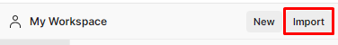

# Backend Test MSBU
### Studi Kasus : Movie Festival
### Dikembangkan Oleh : Marzota Dwi Rahmansyah

## Content :
- File Project
- SQL : u633362372_lion_test.sql
- Postman API Documentation : https://documenter.getpostman.com/view/3242026/2sAYBYeVPH
- Postman API Collection : MSBU Test.postman_collection.json

## Cara Penggunaan :
1. Menjalankan Aplikasi :
    - Extract file zip yang telah diberikan
    - Import database dengan menjalankan file SQL
    - Ubah file .env sesuai dengan kebutuhan
    - Buka terminal pada IDE (Visual Studio / GoLand)
    - Ketik go run main.go lalu enter
2. Import Postman API Collection :
    - Buka aplikasi Postman
    - Klik import pada menu yang tersedia 
    - Pilih file collection yang telah diberikan

## Penggunaan API :
1. User : Terbagi menjadi 2 role (user dan admin)
    - insert-user : memerlukan login, token, dan hanya dapat dilakukan oleh role admin (otomatis mendapatkan role user). untuk role admin pertama, sudah diberikan 1 user (msbu_admin : M5bu_@dmIn) yang sudah tersimpan di database.
    - generate-admin : memerlukan login, token, dan hanya dapat dilakukan oleh role admin (pengguna baru otomatis mendapatkan role admin)
2. Auth :
    - login : menggunakan username dan password sesuai dengan yang telah diisi oleh user. setelah login, akan mendapatkan token jwt yang nantinya akan digunakan untuk mengakses halaman yang memerlukan token.
3. Movie : Membutuhkan token
    - insert-movie : memerlukan login, dan hanya dapat diakses oleh admin. digunakan untuk menambahkan film
    - update-movie : memerlukan login, dan hanya dapat diakses oleh admin. digunakan untuk mengubah film
    - get-movie : memerlukan login, dan dapat diakses oleh user atau admin. digunakan untuk melihat film yang sudah terdaftar.
    - get-movie-detail : memerlukan login, dan dapat diakses oleh user atau admin. digunakan untuk melihat detail film yang dipilih.
    - get-most-viewed : memerlukan login, dan hanya dapat diakses oleh admin. digunakan untuk melihat film yang paling banyak dilihat.
4. Genre : Membutuhkan token
    - insert-genre : memerlukan login, dan hanya dapat diakses oleh admin. digunakan untuk menambahkan genre film
    - get-genre : memerlukan login, dan hanya dapat diakses oleh admin. digunakan untuk melihat genre film yang sudah terdaftar.
    - get-genre-detail : memerlukan login, dan hanya dapat diakses oleh admin. digunakan untuk melihat detail genre film yang dipilih.
    - get-most-viewed : memerlukan login, dan hanya dapat diakses oleh admin. digunakan untuk melihat genre film yang paling banyak dilihat.
5. Vote : Membutuhkan token
    - vote : memerlukan login, dan hanya dapat diakses oleh user. digunakan untuk menambahkan atau menghapus like dari film yang dipilih.
    - check-vote : memerlukan login, dan hanya dapat diakses oleh admin. digunakan untuk melihat apakah film yang dipilih disukai oleh user yang dipilih.

